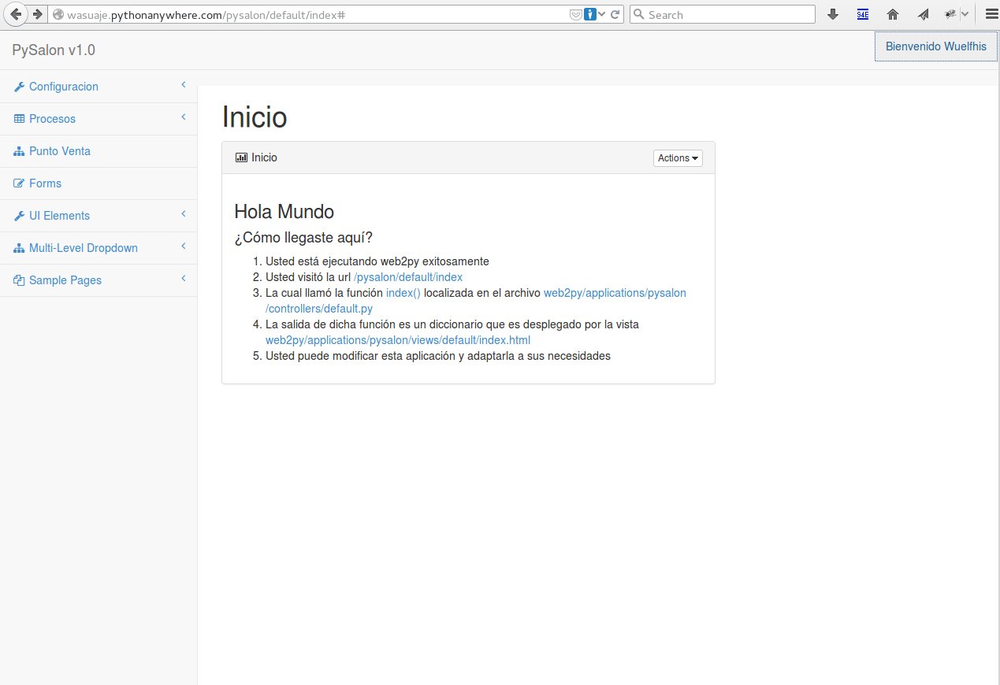
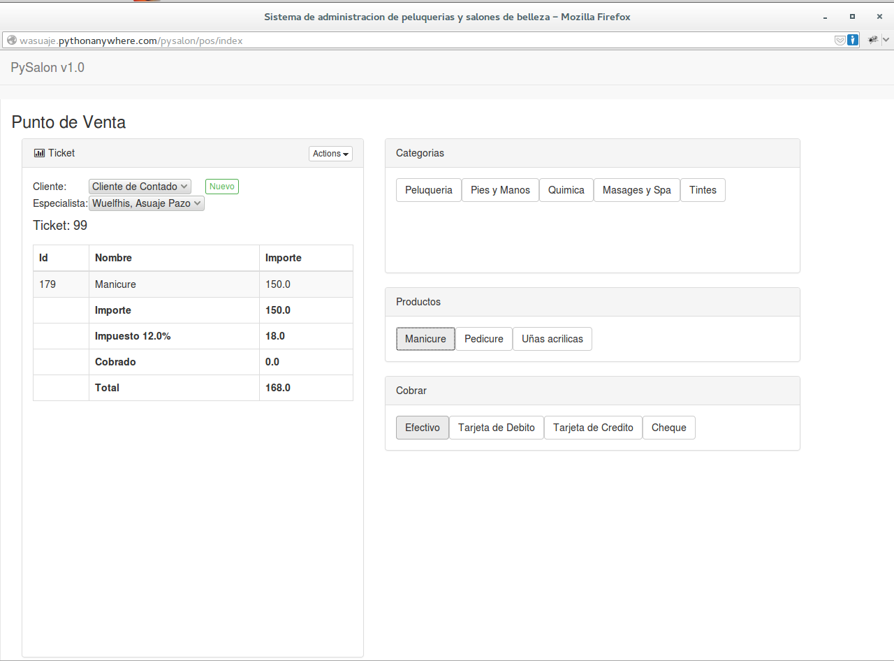

=======
Pycitas
=======

Es un proyecto WEB2py (Python) para manejo de peluquerias y salones de belleza con estilo 
bootstrap3 `AppointmentManager <http://http://getbootstrap.com/>`_. Para verlo en funcionamiento pueden
ir a `PySalon <http://http://wasuaje.pythonanywhere.com/pysalon>`_. Pruebe registrandose si tiene algun problema
envieme un email

Requiere:
---------

::

 - Web2py instalado y funcionando.
 - La libreria FPDF.

Instalacion:
------------

- Descomprima o haga git clone el la carpeta application de su instalacion web2py

::

 git clone https://github.com/wasuaje/pySalon.git

Punto de Venta:
-----------------

::

 Facture y cobre por servicios

Ayuda:
-----------------

::

 Comunicate conmigo a wasuaje@hotmail.com si tienes duda o encuentras problemas para implementarlo.
